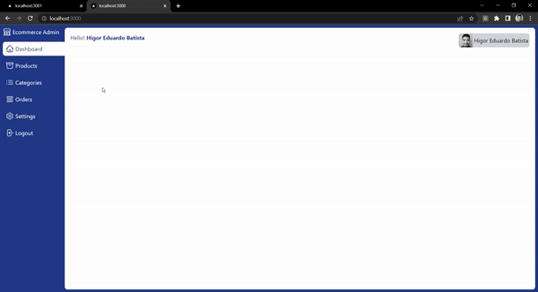

Application developed in Next and Mongo

> :fire: Development

```
  docker compose up -d && docker inspect mongo | grep IPAddress
  npm install -g http-server
  cd admin && yarn && yarn dev && http-server ./
  cd web && yarn && yarn dev
```

> :gear: Environment Variables

- Environment variable: NODE_ENV `web` `admin`
- Mongo URL: MONGODB_URI `web` `admin`
- Google ID: GOOGLE_ID `web` `admin`
- Google secret: GOOGLE_SECRET `web` `admin`
- Http server URL: NEXT_PUBLIC_API_URL `web`
- Web URL: NEXT_PUBLIC_URL `web`
- Stripe public key: STRIPE_PUBLIC_KEY `web`
- Stripe secret key: STRIPE_SECRET_KEY `web`

> :thought_balloon: `Dawind`




> :dart: Documentation

- Google callback: `http://localhost:3000/api/auth/callback/google`
