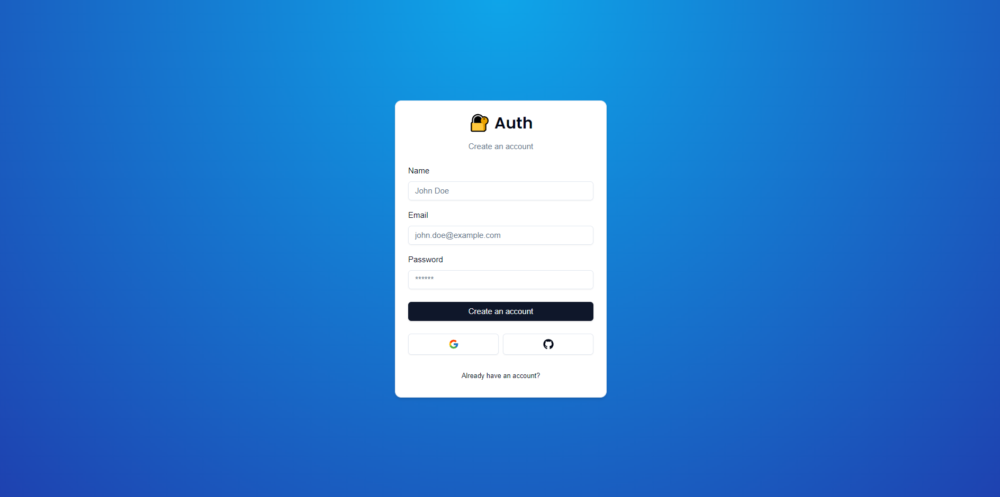

Application developed in Next, Express and PostgreSQL

> :fire: Development

```
  docker compose up -d && docker inspect postgres | grep IPAddress
  cd web && yarn && yarn dev
  cd server && yarn && yarn migrate:dev && yarn dev
```

> :fire: Production

```
  cd web && yarn build
  cd server && yarn migrate:deploy && yarn build && yarn start

  cd server && yarn migrate:deploy && yarn build && yarn forever:start
```

> :gear: Environment Variables

- Server URL: NEXT_SERVER_URL `web`
- Server environment: NODE_ENV `server`
- Server port : PORT `server`
- PostgreSQL URL: DATABASE_URL `server`
- Server Security Token: DEFAULT_TOKEN `server`
- Server SSL KEY: SSL_KEY `server`
- Server SSL CERTIFICATE: SSL_CERT `server`

> :thought_balloon: `Bonieky`



> :dart: Documentation

<details>
<summary>:scroll: Roles</summary>

#### 1 - REQUISITOS PROJETO:

**Painel Administrativo:**

- Cadastrar EVENTOS
- Cadastrar GRUPOS
- Cadastrar PESSOAS

**Site:**

- Acessar tela do EVENTO

**Características:**

- O banco não pode identificar quem tirou quem
- Sorteio ocoore no momento do CADASTRO
- O painel de administação deve ter senha única

#### 2 - BANCO DE DADOS:

- EVENTO
- GRUPO
- PESSOA

**events:**

- id INT PK AUTO_INCREMENT
- status BOOLEAN default=false
- title VARCHAR
- description VARCHAR
- grouped BOOLEAN default=false

**eventGroups:**

- id INT PK AUTO_INCREMENT
- id_event INT (events.id)
- name VARCHAR

**eventPeople:**

- id INT PK AUTO_INCREMENT
- id_event INT (events.id)
- id_group INT (eventGroups.id)
- name VARCHAR
- cpf VARCHAR
- matched VARCHAR default=""

#### 3 - ROTAS:

**Privada:**

- POST /admin/login

- GET /admin/events
- GET /admin/events/:id
- POST /admin/events
- PUT /admin/events/:id
- DELETE /admin/events/:id

- GET /admin/events/:eventId/groups
- GET /admin/events/:eventId/groups/:id
- POST /admin/events/:eventId/groups
- PUT /admin/events/:eventId/groups/:id
- DELETE /admin/events/:eventId/groups/:id

- GET /admin/events/:eventId/groups/:eventGroupId/people
- GET /admin/events/:eventId/groups/:eventGroupId/people/:id
- POST /admin/events/:eventId/groups/:eventGroupId/people
- PUT /admin/events/:eventId/groups/:eventGroupId/people/:id
- DELETE /admin/events/:eventId/groups/:eventGroupId/people/:id

**Pública:**

- GET /eventos/:id
- GET /eventos/:id/people?cpf=123

- /
- /eventos/[id]

</details>
